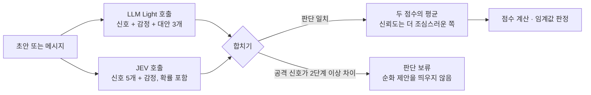
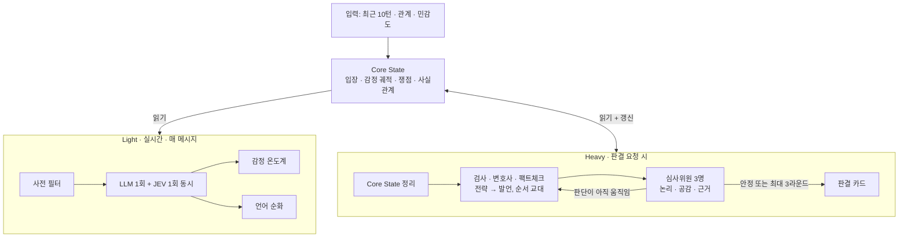

# KU래쪄용 — 프로젝트 총정리

2026년 10월 7일 기준. 지금 무엇이 만들어져 있고, AI를 어디에 어떻게 쓰며, 무엇이 남았는지를 한 문서로 정리했습니다.
세부 내용은 각 장 끝의 링크 문서를 보세요.

> **가장 중요한 한 가지**
> 코드·프롬프트·화면·테스트는 모두 갖춰져 있고 API 키만 넣으면 실제 모델로 전환됩니다.
> 그러나 **실제 LLM(OpenAI)과 JEV(TypeSafe)는 아직 한 번도 호출하지 않았습니다.** 지금까지의 확인은 전부 키 없이 도는 오프라인 규칙과 가짜 응답으로 한 것입니다.
> 발표 전에 반드시 키를 넣고 6장의 순서대로 확인하세요.

## 1. 무엇을 만들었나

두 사람이 서로 다른 기기에서 대화하는 채팅 앱이고, 대화 중에 AI가 네 가지로 개입합니다.

| 기능 | 사용자가 보는 것 | 기획서 |
|---|---|---|
| **언어 순화** | 보내기 전에 날 선 표현을 감지하고 대안 3개 제시. 그대로 보내기, 고쳐서 보내기, 직접 요청도 가능 | p9~10 |
| **감정 온도계** | 나와 상대의 표현된 감정을 5단계로 표시. 임계값을 넘으면 쿨다운 안내와 중재자의 한마디 | p11~12 |
| **상대 반응 미리보기** | 이 말을 보내면 상대가 어떤 감정을 느낄지 8종 확률로 예측 | 추가 기능 |
| **다툼 판결** | 검사·변호사·팩트체크가 토론하고 심사위원 3명이 항목별로 채점. WWE / UFC 모드, 토론 과정 공개, 반론 | p7~8 |

기술 구성: Expo(React Native) 앱 + FastAPI 서버 + SQLite. 방 생성, 초대 코드 참가, 2초 간격 동기화, 재시작 후 복원이 됩니다.

## 2. 어떤 모델을 쓰나

| 모델 | 종류 | 맡은 일 | 설정 |
|---|---|---|---|
| **OpenAI `gpt-4o-mini`** | 생성형 LLM | 갈등 신호·감정 분석, 순화 대안 생성, Core State 정리, 토론, 심사, 중재 제안 | `OPENAI_API_KEY`, `OPENAI_MODEL` |
| **TypeSafe `jev-1.13.0`** | 분류 모델 (생성 불가) | 갈등 신호·감정의 **두 번째 채점자**, 상대 반응 미리보기 | `TYPESAFE_API_KEY`, `JEV_MODEL` |
| **오프라인 규칙** | 키워드 규칙 (AI 아님) | 키가 없을 때 위 둘의 자리를 대신함 | 자동 |

`ANALYSIS_PROVIDER=auto`(기본)는 넣은 키에 따라 자동으로 구성을 고릅니다.

| 넣은 키 | 분석 | 생성·판결 |
|---|---|---|
| OpenAI + TypeSafe | **하이브리드** (LLM + JEV) | OpenAI |
| OpenAI만 | OpenAI | OpenAI |
| TypeSafe만 | JEV | 오프라인 규칙 |
| 없음 | 오프라인 규칙 | 오프라인 규칙 |

현재 구성은 `http://127.0.0.1:8000/v1/config`의 `analysisProvider`, `llmProvider`에서 확인합니다.

### LLM과 JEV를 함께 쓰는 방식 (하이브리드)

두 모델은 성격이 다릅니다. LLM은 한국어 뉘앙스를 이해하고 문장을 쓸 수 있지만 자기 확신도를 스스로 말할 뿐입니다. JEV는 문장을 쓰지 못하지만 단계별 확률과 보정된 신뢰도를 돌려주고 매우 쌉니다(입력 10억 토큰당 42달러, 출력 무료). 다만 영어 위주로 학습되어 한국어는 직접 검증하라고 공식 문서가 안내합니다.

그래서 한쪽이 다른 쪽을 대체하지 않고 **같은 메시지를 독립적으로 채점하는 두 채점자**로 씁니다.



- **평균**: 공격성·비꼼·비난·회복·감정 점수를 평균합니다. 한 모델이 튀어도 영향이 줄어듭니다.
- **불일치 시 보류**: 한 모델은 "명확한 비꼼", 다른 모델은 "없음"처럼 2단계 이상 갈리면 확신할 수 없다고 보고 순화 제안을 띄우지 않습니다. 기획서 p24의 오탐 우려(친구 간 농담을 공격으로 잘못 판단)에 대한 대응입니다.
- **두 호출은 동시에** 실행해 대기 시간이 늘지 않습니다. 대안 3개는 LLM이 씁니다.
- **JEV가 응답하지 않으면** LLM 결과만으로 계속 진행하고 결과 라벨에 "jev 응답 없음"을 남깁니다. 두 번째 의견 때문에 채팅이 멈추지 않게 했습니다.
- **상대 반응 미리보기는 JEV가 전담**합니다. "여러 감정 중 하나를 확률과 함께 고르기"가 JEV의 기본 기능 그대로이기 때문입니다.

판결(토론·심사)에는 JEV를 쓰지 않습니다. 긴 논증을 쓰고 읽는 일은 생성형 모델의 영역입니다.

## 3. AI 파이프라인 요약



**Light (실시간).** 메시지 하나에 LLM 1회로 갈등 신호 5개, 표현된 감정, 순화 대안 3개를 한꺼번에 받습니다. 온도계는 저장된 결과로 계산해 추가 호출이 없습니다. "ㅇㅇ", "넵" 같은 단순 응답은 모델을 부르지 않습니다. 점수 합산과 임계값 판정은 공개된 수식으로 코드가 합니다.

**Heavy (판결).** 대화를 쟁점·입장·사실관계로 먼저 정리한 뒤, 역할 에이전트가 전략을 세우고 발언하며 서로 반박합니다. 관점이 다른 심사위원 3명이 각자 채점하고 평균합니다. 심사위원단의 점수와 의견 분포가 라운드 사이에 움직이지 않으면 일찍 끝냅니다. 2라운드에 끝나면 13회, 최대 19회 호출입니다.

**설계 원칙.** AI는 제안하고 사람이 결정한다. 모델은 신호를 내고 계산은 코드가 한다. 모든 출력을 스키마로 강제하고 다시 검증한다. 지시와 사용자 데이터를 분리한다. 모르면 보류한다. 출처를 남긴다.

→ 자세한 내용: [AI 활용 설명](AI-활용-설명.md)

## 4. 기획서의 논문·자료 반영

| 자료 | 반영한 것 |
|---|---|
| **ChatEval** | 차례로 말하기, 서로 다른 역할의 심사위원 3명, 점수 평균, 첫 발언자 교대 |
| **Adaptive Stability Detection** | 심사위원 의견 분포의 라운드 간 KS 거리로 조기 종료. 논문 원래 방식(베타-이항 혼합)은 평가 세트용 분석 스크립트로 구현 |
| **AgenticSimLaw** | 비공개 전략 → 공개 발언, 모두·반박·최종 발언 단계, 발언·전략·belief·토큰 사용량 전체 기록 |
| **LLMediator** | 제안만 하고 사람이 선택, 고쳐서 보내기, 수동 요청, 요청자에게만 보이는 중재 제안 |
| **AITA / MELD / Sentence-BERT** | 평가 스크립트와 데이터 로더. 데이터는 직접 내려받아야 함 |
| **Perspective API** | 2026년 말 종료 예정, 신규 신청 마감 → 한국어 독성 분류 모델로 대체 |
| EmoBERTa, Qwen, LangGraph, PostgreSQL | 반영하지 않음 (영어 전용이거나 현재 규모에 불필요) |

공개 코드가 확인된 것은 ChatEval뿐입니다. 나머지는 논문의 구조와 프롬프트를 참고해 직접 구현했습니다.

→ 자세한 내용: [논문·소스코드 적용 검토](논문-소스코드-적용-검토.md)

## 5. 실행 방법

```powershell
.\scripts\setup.ps1 -MvpMode
.\scripts\start-backend.ps1
.\scripts\start-frontend.ps1
```

키 없이 바로 실행됩니다(화면에 "오프라인 규칙 기반 예시 · LLM 연결 전" 표시). 실제 모델을 쓰려면 `backend/.env`에 키를 넣고 백엔드를 다시 시작합니다.

```text
OPENAI_API_KEY=sk-...
TYPESAFE_API_KEY=...        # 넣으면 하이브리드 분석이 자동으로 켜짐 (선택)
```

두 사람 시연은 서로 다른 브라우저(또는 시크릿 창)에서 한쪽이 방을 만들고 다른 쪽이 초대 코드로 참가합니다.

→ 자세한 내용: [빠른 시작](MVP-빠른시작.md)

## 6. 키를 넣은 뒤 확인할 순서

1. `python -m unittest discover -s tests` — 39개 통과 (키와 무관)
2. `/v1/config`에서 `llmProvider: openai`, `analysisProvider: hybrid`(또는 `openai`), `offline: false` 확인
3. 앱에서 "진짜 대단하시네 ㅋㅋ 맨날 그 모양이지" 입력 → 대안 3개가 뜨는지
4. `python -m scripts.evaluate --repeats 3` — 한국어 경계 사례 8개의 통과율과 호출 간 편차
5. 4번을 `ANALYSIS_PROVIDER=openai`, `jev`, `hybrid`로 각각 실행해 비교 — JEV가 한국어 비꼼을 제대로 잡는지, 하이브리드가 단독보다 나은지
6. 판결 1회 → 라운드 수, 호출 수, 화면의 "입력 N토큰(캐시 M) · 초" 기록
7. `python -m scripts.evaluate_verdict --swap` — A/B를 바꿔도 점수가 유지되는지

5번이 특히 중요합니다. JEV는 영어 위주 모델이라 한국어 비꼼을 놓치면 하이브리드에서 "판단 보류"가 잦아져 순화 제안이 덜 뜰 수 있습니다. 그럴 때는 `ANALYSIS_PROVIDER=openai`로 두고 JEV는 상대 반응 미리보기에만 쓰는 구성을 검토하세요(현재는 설정 하나로 분리되지 않으므로 필요하면 추가 작업이 필요합니다).

## 7. 확인한 것과 확인하지 못한 것

**확인한 것**
- 백엔드 테스트 39개, 프론트 타입 검사·ESLint·단위 테스트 5개 통과
- 브라우저에서 두 참가자로 방 생성 → 동기화 → 순화(대안·고쳐서 보내기·수동 요청) → 양쪽 온도계 → 쿨다운과 중재 제안 → 상대 반응 → 판결(심사위원 3명, 조기 종료) → 반론 → 서버 재시작 후 복원. 모두 오프라인 규칙 모드
- JEV 어댑터를 공식 문서의 응답 형식으로 만든 가짜 서버에 연결해 요청·파싱 확인
- 하이브리드의 평균, 불일치 보류, JEV 장애 시 대체 동작
- 논문 방식 안정성 분석을 합성 데이터로 검증

**확인하지 못한 것**
- OpenAI와 JEV의 실제 호출 전부
- 프롬프트 품질: 한국어 비꼼 감지, 대안의 자연스러움과 의미 보존, 판결의 공정성
- JEV의 한국어 성능, 하이브리드의 불일치 기준(2단계)이 적절한지
- 심사위원 3명의 의견이 실제로 갈리는지, 조기 종료 기준이 적절한지
- 응답 지연, 비용, prompt caching 적중
- 실제 AITA·MELD 데이터와 지정한 평가 모델 실행
- 실제 휴대폰 기기

## 8. 남은 일

| 우선순위 | 할 일 |
|---|---|
| 1 | API 키 연결 후 6장 순서대로 확인 |
| 2 | 팀이 라벨링한 **한국어 양측 갈등 대화 수십 건** 만들기 — 모든 평가가 여기에 달려 있음 |
| 3 | 평가 결과로 임계값 조정: 순화 제안 기준, 하이브리드 불일치 기준, 조기 종료 기준, 심사위원 수 |
| 4 | 실제 휴대폰 두 대로 시연 리허설 |
| 선택 | PostgreSQL, WebSocket, 로그인, 로컬 모델 |

## 9. 문서와 코드 위치

| 문서 | 내용 |
|---|---|
| [AI 활용 설명](AI-활용-설명.md) | 프롬프트 설계, Light·Heavy 경로, 검증, 비용 절감, API 연결 |
| [논문·소스코드 적용 검토](논문-소스코드-적용-검토.md) | 논문별 반영 내용과 근거, 평가 스크립트 사용법 |
| [빠른 시작](MVP-빠른시작.md) | 설치와 실행 |
| [MVP 구현과 방법론](MVP-구현-방법론.md) | 저장·토큰·동기화·API 계약 (AI 관련 장은 이전 버전) |

| 코드 | 역할 |
|---|---|
| `backend/app/prompts.py` | 모든 프롬프트 |
| `backend/app/provider.py` | OpenAI 연결 지점 (`structured()` 하나) |
| `backend/app/jev.py` | JEV 연결 |
| `backend/app/hybrid.py` | LLM + JEV 결합 |
| `backend/app/analysis.py` | provider 선택, 사전 필터, Light 진입점 |
| `backend/app/scoring.py` | 점수·온도·임계값 계산 (모델 무관) |
| `backend/app/verdict.py` | Core State, 토론, 심사위원단, 조기 종료, 반론 |
| `backend/app/offline.py` | 키 없을 때의 규칙 기반 대체물 |
| `backend/scripts/` | 평가: `evaluate`, `evaluate_verdict`, `evaluate_rewrite`, `stability` |
| `frontend/src/screens/` | 채팅, 판결, 설정 화면 |
